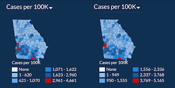
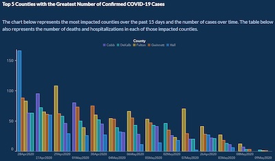

# VisLies 2020 Gallery

October 27, 2020

Thanks to the COVID-19 pandamic, we had to hold VisLies as virtual meeting this year.
Although we always enjoy meeting each other in person, we were still able to have a great VisLies session.
We had probably the largest group ever, with around 75 people consistently participating.
Attendees spanned the globe from Austrailia to the U.S. to Europe.

Unfortunately, due to a snafu, we don't have a record of everyone who presented this year, so our gallary is a bit incomplete.
If you remember presenting something, send us a note to <a href="mailto:vislies2020@vislies.org">vislies2020@vislies.org</a> so we can add your contribution.

## Early Panic

It is no suprise that visualization lies about COVID-19 were a common theme this year.
[Ken Moreland] started by presenting this early infographic about COVID-19 from [an article in the Sun] from late January.
At the time, the disease was mostly constrained to China, but was beginning to spread around the world.
This was definitely a bad sign, but this graphic makes it look like the pandemic had already taken hold around the world.
If you look at the numbers, you see that all countries have only 1 or 2 cases, but are labeled the same as China with hundreds of cases.

But by far the biggest what the heck about this graphic are the black labels.
The black label for China is about the number of deaths.
Butthe black label on the U.S. is just about potential infections.
The similarity of the label design suggests that they are tomeanthe same thing, but you cannot get more different than a person confirmed dead and a person who may or may not have gotten sick.
It is a cheap trick to make the spread seem much worse than it actually was (at the time).

[Ken][Ken Moreland] provided this "corrected" version of the graphic.
In this graphic, each case is represented by a dot.
This shows the proportional amount of infections (total, not per-capita) in different parts of the world.

One issue with a display like this is that for a country with a small number of infections (for example 1), it can be difficult to see or notice.
There is a big difference between 0 and 1 infections.
To makeit more clear in what countries infections have occured, an arrow is provided to highlight the country.
 
[an article in the Sun]: https://www.thesun.co.uk/news/10799738/coronavirus-could-already-spread-uk/

## Downplay the Threat

Whereas some exaggerated the threat of COVID-19, others downplayed it.
[Ken][Ken Moreland] presented this plot comes from [an article from Swiss Policy Research].
This plot purportedly demonstrates the deadliness of COVID-19 by comparing the disease's deaths to all other deaths.
According to the visualization, COVID-19 deaths look insignificant.
But there are several things this plot does to minimize the apparent COVID-19 deaths.

First, although there were some deaths in China early on, COVID-19 did not really start taking off worldwide until 2-3 months into the year. 
iven that this plot is only for the first 8 months of 2020, this means that the total deaths are counting deaths for nearly twice as much time.

Second, it’s not clear how accurate the data is.
The source does not make it clear how these data were collected (other than total deaths were interpolated from "Our World in Data" figures).
Counting COVID-19 deaths is tricky, and how you count can affect the size.
So it is important to describe the source of this data.
For example, both the [CDC COVID-19 count] and the [Our World Data COVID-19 count] use excess mortaility, which shows a much more significant percentage of deaths.

Third, compared to total deaths, most of the worlds deadliest problems look small.
Take, for example, this recent plot from [a USA Facts article] shows that in recent months COVID-19 is the third largest killer, above diseases such as stroke and diabetes.
It is hard to argue that stroke is an insignificant disease.
Granted, the COVID-19 death rate in the U.S. is higher than the world as a whole, but representing the disease as insignificant is not honest.

[an article from Swiss Policy Research]: https://swprs.org/covid-the-big-picture-in-7-charts/
[CDC COVID-19 count]: https://www.cdc.gov/nchs/nvss/vsrr/covid19/excess_deaths.htm
[Our World Data COVID-19 count]: https://ourworldindata.org/excess-mortality-covid
[a USA Facts article]: https://usafacts.org/articles/top-causes-death-united-states-heart-disease-cancer-and-covid-19/

## Change of Scale

We all want to feel like we are doing well with handling the pandemic.
Sometimes this leads to the fibbing of some data.
[Bernice Rogowitz] presented these choropleth maps provided by the [Georgia Department of Public Health].
The left map shows the number of COVID-19 cases, per county, in June (on the left) and July (on the right).
The two maps look quite similar, and one might be lead to believe that the spread of COVID-19 us under control.
But a closer look reveals that the scale of the colors has changed.
Note that the largest number of cases in June is 4,661, but this jumps by about 500 cases to 5,165 in July.

(It should be noted that the [Georgia Department of Public Health] has since fixed the problem.)

[Georgia Department of Public Health]: https://dph.georgia.gov/covid-19-daily-status-report

## Change of Order

The [Georgia Department of Public Health]'s troubles with data display didn't end there.
[Bernice][Bernice Rogowitz] also showed this bar chart showing a sharp downward trend of new COVID-19 infections.
Or at least it seems that way.
If we look more closely, we see that the bars are written out of order.
Rather than being displayed in chronological order, they have been resorted from highest to lowest bars, making the decline look much steeper than it actually is.
To reinforce this, the bars for the counties are also reordered in each group.
[A graph with a corrected order] shows a much less dramatic trend.

Whereas readjusting the scale is a simple error to make by mistake, it takes some work to mangle the visualization in this way.

[Georgia Department of Public Health]: https://dph.georgia.gov/covid-19-daily-status-report
[A graph with a corrected order]: https://drive.google.com/file/d/1QR3-W6sW8LsyqQi1HRzukCYUZ2d2ajiI/view?usp=sharing

[Ken Moreland]: http://kennethmoreland.com
[Bernice Rogowitz]: https://sites.google.com/site/bernicerogowitz/
